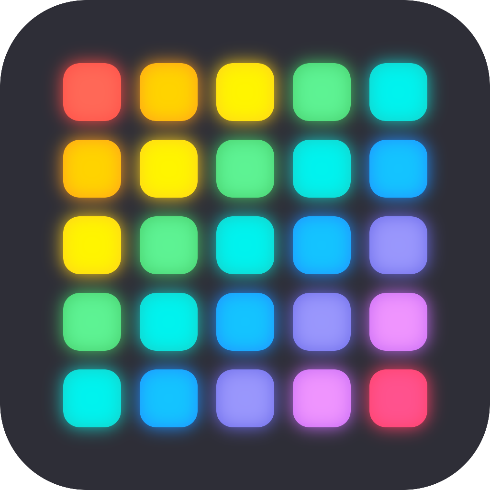

# DDP Viewer

A cross-platform Flutter app that listens for **DDP (Distributed Display Protocol)**
pixel data on the network and renders it live on screen. Point any DDP sender
(xLights, [pixel_mapper], FPP, etc.) at the machine running DDP Viewer and watch
your layout light up — no physical controllers or LEDs required.



## Features

- **Live DDP receiver** — listens on UDP port 4048 and reassembles incoming
  packets into frames. Rendering is decoupled from packet arrival, so the
  display stays flicker-free no matter how a sender chunks frames or uses the
  PUSH flag.
- **Two layout modes:**
  - **Matrix** — a simple *width × height* pixel grid you configure in-app.
  - **xModel** — import an xLights `.xmodel` Custom model file to render its
    exact pixel grid (including sparse/irregular layouts).
- **Configurable color order** — RGB, GRB, BGR, RBG, GBR, or BRG, so WS2812
  strips (usually GRB) and other devices all display with correct colors.
- **Channel offset** — start reading at any channel, handy for viewing one
  model inside a larger universe.
- **Live stats overlay** — FPS, packets/second, last sequence number, displayed
  pixel count, and the source IP of the last datagram.
- **Built-in test pattern** — an animated rainbow drives the canvas without any
  sender on the network, to confirm a layout renders correctly.

## Supported platforms

- Android
- Windows

(The project also contains the standard Flutter scaffolding, so other targets
can be added with `flutter create .`.)

## Getting started

```bash
flutter pub get
flutter run            # pick a connected device or the Windows desktop target
```

Then, from a DDP sender on the same network, send pixel data to this device's
IP on port **4048**.

### No sender handy?

Use the development tools in [`tool/`](tool/):

```bash
dart run tool/test_sender.dart   # emit a synthetic DDP stream
dart run tool/sniff.dart         # dump incoming DDP packets to the console
```

Or just toggle the in-app **test pattern** to drive the canvas locally.

## Project layout

| Path | Purpose |
| --- | --- |
| `lib/main.dart` | App entry point and the viewer UI |
| `lib/services/ddp_receiver.dart` | UDP listener + DDP frame reassembly |
| `lib/services/xmodel_importer.dart` | Parses xLights `.xmodel` Custom models |
| `lib/models/` | Color order, custom grid, and display layout models |
| `lib/widgets/pixel_canvas.dart` | Renders the pixel buffer |
| `tool/` | Standalone DDP test-sender and packet sniffer |

## App icon

The launcher icon is generated from `assets/icon/icon.png` via
[`flutter_launcher_icons`](https://pub.dev/packages/flutter_launcher_icons):

```bash
dart run flutter_launcher_icons
```

## License

MIT — see [LICENSE](LICENSE).

[pixel_mapper]: https://github.com/computergeek1507
